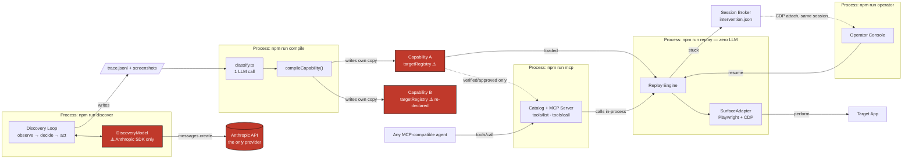

# Forward Design — shared component library & provider-neutral discovery

A design proposal building on top of what's already built (`COMPLIANCE.md` §3.7 "Surface abstraction"), not a description of it. Nothing here is built — per 3.7's own framing ("design, not necessarily build") and the brief's guidance against building scaling infrastructure prematurely, this stays a design.

## Current vs. proposed

Same replay path, same process boundaries (a modular monolith with two genuinely-independent processes — the replay worker and the operator console — for the live-session handoff, unchanged by anything below). The change is scoped to two things: where `targetRegistry` lives, and whether discovery's LLM is pluggable.

### Current

Red = the two problems this proposal addresses: discovery locked to one LLM provider, and `targetRegistry` re-declared per capability.

### Proposed — two columns, by operational cadence

Redrawn as two columns rather than one left-to-right flow, because the pieces genuinely run on two different cadences: once per goal, and once per invocation.

```mermaid
flowchart LR
    subgraph COL1["1) Discovery + Schema Adapter — per goal"]
        direction TB
        D1["Discovery Loop<br/>observe → decide → act<br/>writes trace.jsonl + screenshots"]
        D2["DiscoveryModel interface<br/>provider-neutral<br/>invokes any LLM to perceive the surface"]
        D3["Component enricher<br/>classifies controls →<br/>SurfaceComponentLibrary (vendor, app, control)"]
        D4["Compiler — SDK-style<br/>(ergonomic + raw layers, à la @neon/sdk's pattern)<br/>compiles + saves capability, with tenant overrides"]
        D1 --> D2 --> D3 --> D4
    end

    subgraph COL2["2) MCP / Execution — per invocation"]
        direction TB
        M1["MCP Server<br/>tools/list · tools/call"]
        M2["Tools interface:<br/>replay · discovery · stability<br/>Zod-derived tool descriptors"]
        M3["Replay Engine<br/>zero LLM · SurfaceAdapter → Target App"]
        M4["Human-in-the-loop<br/>Session Broker + Operator Console<br/>(separate process, CDP)"]
        M1 --> M2 --> M3
        M3 -.->|stuck| M4
        M4 -.->|resume| M3
    end

    D4 -->|artifact + library entry| M1
    M2 -.->|"invoke: run discovery, in-process"| D1
    M2 -.->|"invoke: run stability check, in-process"| M3

    classDef newthing fill:#1e8449,color:#fff,stroke:#000
    class D2,D3,D4,M2 newthing
```

Green = new (the provider-neutral interface, the component enricher/compiler, the widened MCP tools interface). Everything else — the replay engine, the session-broker/operator-console handoff, the process boundaries themselves — is identical to what's built today: this is an additive design change, not a rearchitecture.

**Column 2's tools interface widens, it doesn't just add a fourth box.** Today's MCP server exposes exactly one tool family — invoke a capability. The proposal has it expose three, all resolved the same way (Zod schema → tool descriptor, the same mechanism `src/catalog/index.ts` already uses): invoke a capability (existing), run discovery on a new goal (new), and run an N-times stability check on an existing capability (new — `scripts/stability.ts` already does the check, this just exposes it over MCP too). All three stay in-process calls inside the one already-long-running `npm run mcp` server — no per-request subprocess, no new service.

## The write-up

The per-capability model in `COMPLIANCE.md` has a real limit the CTRM lineage described there points at directly: `targetRegistry` lives *inside* each capability, so every capability on the same app re-declares its own copy of every control it shares with siblings. Not hypothetical — checkable in this repo right now: `"member identifier input"`, `"member search submit"`, `"member not found banner"`, and `"accounts navigation"` are independently re-declared, near-verbatim, in `member.read-savings-balance.v1.json`, `member.create-sub-account.v1.json`, and `member.close-sub-account.v1.json` — one of them even says so in its own rationale ("Same field as member.read-savings-balance's target"). The CTRM object hierarchy never had this problem: `View → Pane → Grid → Row → Cell` was built *once per application*, and every automated workflow against that application referenced it — the hierarchy was the reusable asset, not something each workflow re-derived.

**`SurfaceComponentLibrary`** is that same idea, reconstructed for a surface without source access: a `(vendor, app)`-scoped, versioned artifact holding exactly what `targetRegistry` holds today (`semanticPurpose → Target`), stored the same way capabilities already are — a JSON file on disk, loaded synchronously, no new service. A `CapabilityDefinition` resolves `targetPurpose`/`semanticPurpose` against the library first, its own (now much smaller) `targetRegistry` only for controls genuinely private to one flow. A `config`-level override (per tenant) reuses `TenantBinding`'s existing override mechanism rather than a second one — the same three levels `docs/phase-2-scale.md` already names for capabilities (`CapabilityDefinition → VersionVariant → TenantBinding`), applied one layer down to components instead of flows. An optional `kind` annotation (`dropdown`, `scrollarrow`, `calendar`, `tableheaders`) lets a validator catch a nonsensical action-to-control pairing (a `select` against a scroll arrow) without touching `ActionTypeSchema` or `Strategy` at all.

**The economics this is actually for:** discovery cost per new tenant isn't flat, it's a learning curve. Early on, a new credit union on a known vendor product (say Fiserv) still needs substantial discovery — the library barely covers it. As the library's coverage of that vendor's actual surface grows, onboarding the *next* tenant on the same product increasingly becomes "diff against the library, discover only what's genuinely different," not a fresh run — the same reason a CTRM shop with source access never re-mapped `Grid/Row/Cell` per customer. `(ActionType, SemanticPurpose)` stays scoped per `(vendor, app)` deliberately: a "table headers" component means something different, and gets classified differently, for ServiceNow than for Fiserv — the library doesn't converge to one universal component set, it converges *per vendor product*, which is the shape hundreds-of-tenants-many-apps actually has.

**Discovery already half-builds this.** The compiler's `classify.ts` step already does one LLM call classifying every acted-on control into a semantic purpose — the only change is the write target: into the shared library (keyed by `vendor/app/semanticPurpose`, creating an entry or reusing one) instead of straight into one capability's inline `targetRegistry`.

**Provider-neutral discovery closes the other half of vendor neutrality.** Execution is already vendor-neutral — replay has zero LLM calls of any kind, and the capability catalog is exposed over genuine MCP, invocable by any agent. Discovery is not, and checkably so: `DiscoveryActionSchema` (the tool vocabulary) is already Zod, already provider-neutral, but `DISCOVERY_TOOLS` is hand-written directly in Anthropic's own tool shape (its own comment says this was deliberate, not an oversight), and `DiscoveryModel` is Anthropic-SDK-specific end to end. The fix mirrors what the capability catalog already does: derive tool definitions from `DiscoveryActionSchema` generically via `zod-to-json-schema` — the same mechanism, not a new one — behind a small `DiscoveryModel` interface (`decide(ctx, priorResult) → DiscoveryAction`) that today's Anthropic implementation satisfies and a second provider's could too. The complete picture becomes symmetric: **discovery is LLM-driven and provider-neutral; execution (replay, the MCP server, every adapter) is deterministic and has never called an LLM** — vendor-neutral at both ends, not just the one already built.

**None of this adds a service.** The component library is a file, loaded like `capabilities/*.json` already is. The provider abstraction is new classes inside `src/discovery/`, not a new process. Extending the MCP server's existing tool set to "run discovery" or "run a stability check" means new handlers in the *same* long-running `npm run mcp` process, calling `runDiscovery()`/`stability`'s logic directly in-process — exactly how `tools/call` already invokes `replay()` today, not a spawned subprocess per request. The one place a separate OS process stays genuinely required — the replay worker and the operator console, for the live-session handoff — is untouched by any of this.
